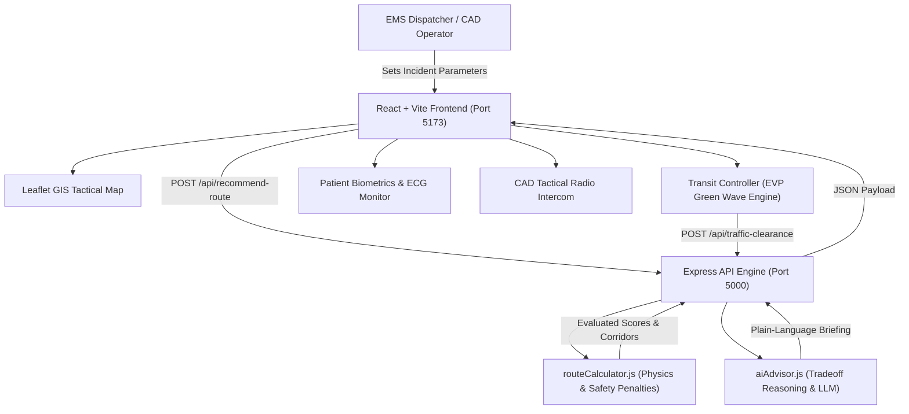

# SwiftAid System Architecture (CAD-ITS)

This document details the system design, routing engine physics, Emergency Vehicle Preemption (EVP) architecture, and communication flow.

---

## 1. Routing & Safety Engine (`backend/services/routeCalculator.js`)

The routing engine dynamically calculates travel times ($T_{\text{adj}}$) and composite safety indices ($S \in [0, 100]$):

### A. Temporal & School Zone Adjustments
- If transit time coincides with school hours ($07:30 - 09:00$ or $14:30 - 16:00$) and corridor intersects an active school zone:
  - $T_{\text{adj}} \leftarrow T_{\text{base}} + 6.0\text{ min}$ (20 MPH speed limit, school bus halts, student crosswalk queues).
  - Safety penalty: $-38\text{ points}$ due to vulnerable pedestrian density.

### B. Weather & Arterial Highway Adjustments
- **Rain**:
  - Highway routes: Hydroplaning hazard at high speeds ($-22\text{ safety points}$, $+3\text{ min}$).
  - Surface streets: $-8\text{ safety points}$, $+1.5\text{ min}$.
- **Snow**:
  - Highway routes: Black ice & extended braking distance ($-35\text{ safety points}$, $+6\text{ min}$).
  - Residential roads: Unplowed snow accumulation ($-20\text{ safety points}$, $+4\text{ min}$).

### C. Patient Acuity Weighting
- **Code 3 Critical**: Priority is minimized transit time, but high-risk bottlenecks in active school zones are heavily penalized to avoid pedestrian strike hazards.
  $$\text{Score} = (S \times 0.4) + ((25 - T_{\text{adj}}) \times 3.5) - \text{SchoolZonePenalty}$$
- **Code 2 Emergent**: Balanced urgency.
- **Code 1 Routine**: Safety, comfort, and smooth road conditions take highest priority.

---

## 2. Emergency Vehicle Preemption (EVP) Engine

The Green Wave EVP system coordinates with municipal traffic management:
1. **Radar Geofence**: The ambulance emits a simulated 400m preemption beacon ahead of its current GPS coordinates.
2. **Signal Preemption**: Approaching traffic signals transition from `RED` $\rightarrow$ `PREEMPTED (GREEN WAVE)`.
3. **Queue Dissipation**: Queued cross-traffic is held at red; corridor traffic moves to the shoulder, reducing vehicular congestion to near zero.
4. **Manual Dispatcher Override**: Operators can manually preempt individual intersections or invoke "Clear All" for the complete corridor.

---

## 3. Client Audio & Speech Synthesis

To ensure offline reliability with zero external asset dependencies:
- **Emergency Siren**: Synthesized in real-time via Web Audio API `AudioContext` using a two-tone variable oscillator (650 Hz to 950 Hz wail).
- **Voice Guidance**: Vocalized via the native W3C `SpeechSynthesis` API with automatic pacing.
